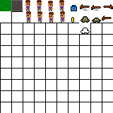

# Atire nos Zumbies e Sobreviva - Jogo inteiro em Java
## Mini Documentação

## SpriteSheets

    * Player
    * Enemy
    * LifePack
    * Gun
    * Bullet
    * Wall
    * Floor

## Os Pacotes e suas Classes

### Entities
  * Focado em todos aspectos gráficos com "vida"

Sobre algumas:

Entity -> Classe principal, onde armazena os principais atributos presentes em todos, como: Posição X, Y, largura, altura e métodos como Tick (Responsavel pela lógica de cada classe) e Render.

Player -> Player movimenta em base do Speed definido, tanto em eixo X como Y, e suas animações são armazenadas no Buffer para que numa taxa proxima a 1/4 de segundo seja trocada os sprites e crie o efeito animado.

Enemy -> Possui os mesmos conceitos do Player. A diferença principal está na movimentação e mascara. A movimentação é feita de forma randomica em direção ao eixos do Jogador e uma mascara Retangular é colocada em volta dele para que não se aglomere com os outros inimigos e nem com o jogador.

Gun -> Uma animação simples também foi adicionada para que tenha melhor efeito visual, seguindo os mesmos métodos de armazenar num vetor de Buffer das duas mecionadas anteriormente.

### Graficos
  * Focada em armazenar a busca pelos elementos no spritesheet.png, "recortando" as partes que vão sendo definidas para outras classes.

### Main
  * Armazena a classe principal do Jogo, onde a janela, o Looping, o inicio e o fim são definidos e os atributos gerais.

### World
  * Focado nos elementos do mundo como Tiles(chão e parede) e Camera.

Sobre algumas:

Tile -> "Recorta" e armazena do spritesheet as imagens correspondentes a parede chão e renderiza em seguida no mundo com as coordenadas corretas

World -> Carrega e trabalha com todas as entidades de forma estatica na tela, seguindo um conceito de Engine.

### Colisões

A colisão do jogador com os Tiles é verificada com a estratégia do retangulo, e não Pixel Perfect Collision.

As laterais do jogador são verificadas no próximo X e Y que ele irá assumir.

Usando o Instanceof posso descobrir nas verificações das laterais do jogador se há um Pixel Instanciado como Parede (WallTile). Caso tenha, se o jogador for na direção deles, o InstanceOf retornando TRUE fará o "bloqueio" do incremento de X e Y do Jogador, o que equivale a colisão.

## Mais sobre World

### Esse mapa funciona como uma Engine própria. 

A classe World fica responsavel de armazenar um vetor com cada pixel dessa imagem sendo que cada posição armazenará a cor do pixel

Nas cores correspondetes aos inimigos serão renderizados os inimigos de forma estatica e o mesmo com os outros elementos.

Assim para outros jogos futuros, posso reaproveitar o mapa e a renderização do mundo apenas alterando os cores e as posições.

Exemplo:
* Se eu quiser mais inimigos, é só pintar mais quadrados vermelhos e apenas isso.

* O movimento é feito separadamente em cada classe propria das entidades.

Para esse jogo em especifico temos que as cores:

    [x] Branca - Parede (WallTile)
    [x] Preta - Chão (FloorTile)
    [x] Vermelha - Inimigo (Enemy)
    [x] Verde - Vida (LifePack)
    [x] Amarelo - Munições (Bullet)
    [x] Azul - Arma (Gun)
    [x] Rosa - Jogador (Player)
